# 🏠 Debian HomeServer Lab

A hands-on homelab built with **Debian 12** and **Oracle VirtualBox**, focused on learning and practicing Linux system administration.

The goal of this project is to progressively build a clean and functional Linux server environment while documenting each major configuration step.

The lab currently covers:

- Debian server installation
- Linux user and privilege management
- Dedicated data storage
- Filesystem configuration
- Persistent mounts
- Linux groups and permissions
- SSH remote administration

> This repository documents a learning environment. It will evolve progressively as new services, security mechanisms and infrastructure components are added.

---

## 📌 Project Status

### Phase 1 — Server Foundation ✅

- [x] Create the virtual machine
- [x] Install Debian 12
- [x] Configure the administrative user
- [x] Install and configure `sudo`
- [x] Add a dedicated virtual data disk
- [x] Partition the data disk
- [x] Format the partition with ext4
- [x] Mount the disk on `/srv/data`
- [x] Configure persistent mounting with `/etc/fstab`
- [x] Create the `homelab` group
- [x] Configure storage permissions
- [x] Validate non-root write access
- [x] Enable and test SSH
- [x] Configure SSH key authentication

---

## 🖥️ Environment

| Component | Configuration |
|---|---|
| Hypervisor | Oracle VirtualBox |
| Operating System | Debian GNU/Linux 12 |
| Hostname | `homeserver-lab` |
| System Disk | 30 GB |
| Data Disk | 20 GB |
| Data Filesystem | ext4 |
| Data Mount Point | `/srv/data` |
| Remote Administration | OpenSSH |
| SSH Authentication | Ed25519 key |

---

## 1. Debian Installation

The project starts with a dedicated Debian 12 virtual machine running inside Oracle VirtualBox.

The VM is intentionally kept lightweight because the server is primarily designed to be administered from the command line.

The virtual machine was configured with the resources required for the lab environment.

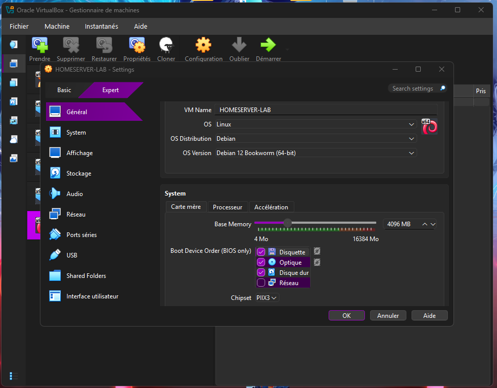

During installation, only the required Debian components and standard system utilities were selected.


---

## 2. Initial System Verification

After the first boot, the base system was checked before making additional changes.

```bash
hostname
whoami
ip -br a
lsblk
```

These commands verify:

- the configured hostname;
- the current user;
- available network interfaces;
- detected block devices and partitions.

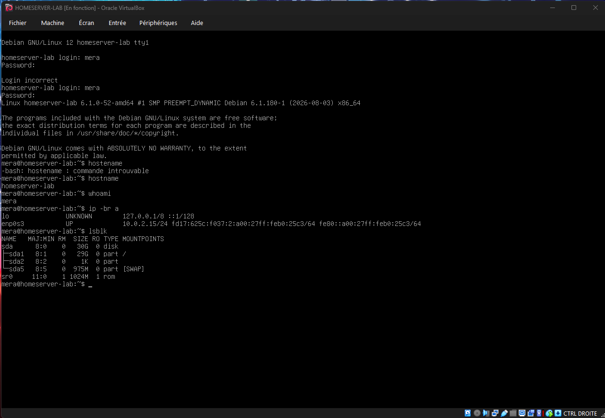

At this point, the Debian installation is operational and the main system disk is correctly detected.

---

## 3. Administrative Privileges

The minimal installation did not initially include `sudo`.

The root account was therefore used temporarily to update the package index and install it.

```bash
su -
apt update
apt install sudo
```

The administrative user was then added to the `sudo` group:

```bash
usermod -aG sudo mera
groups mera
```

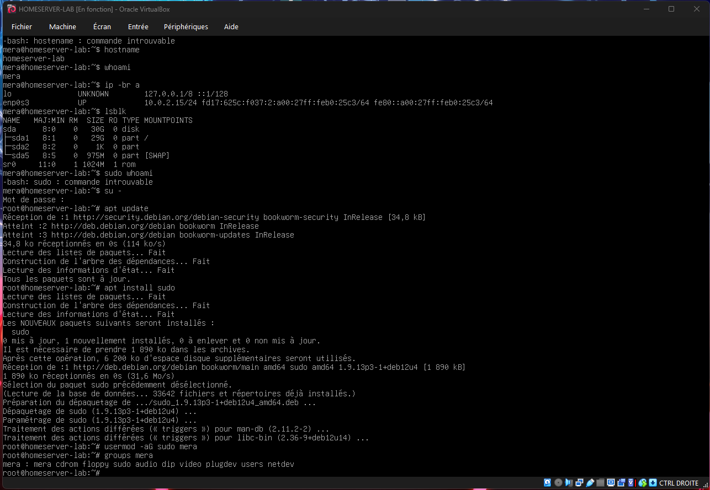

After reconnecting the user session, privilege escalation was tested:

```bash
sudo whoami
```

Expected result:

```text
root
```

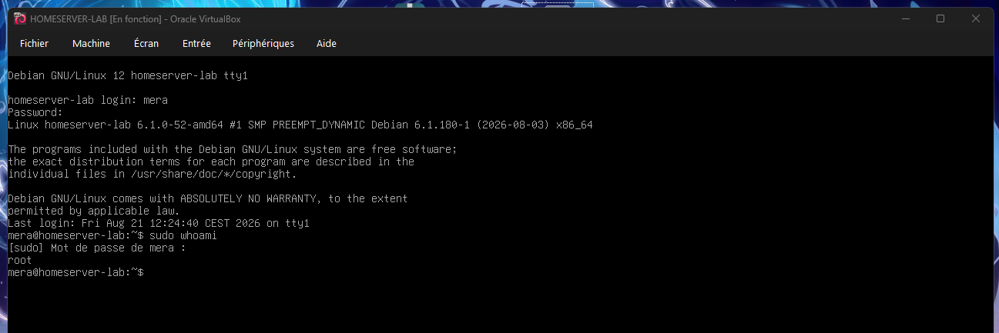

The server can now be administered without using the root account for normal operations.

---

## 4. Dedicated Data Disk

To separate operating system files from future application and service data, a second **20 GB virtual disk** was attached to the VM.

This provides the following layout:

```text
System disk
└── Debian operating system

Data disk
└── Application and service data
```

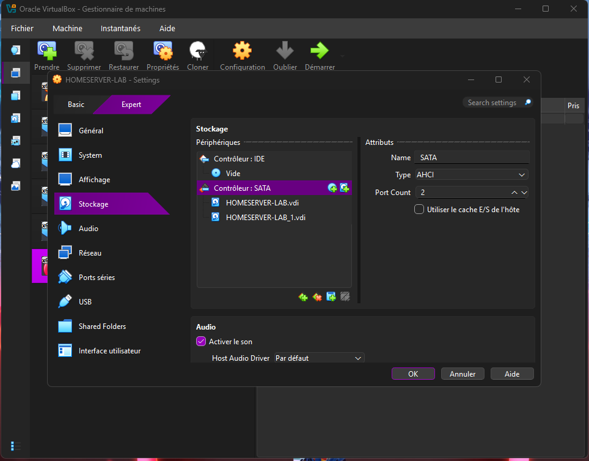

After booting Debian, the new disk was detected with:

```bash
lsblk
```

The additional disk appears as:

```text
/dev/sdb
```

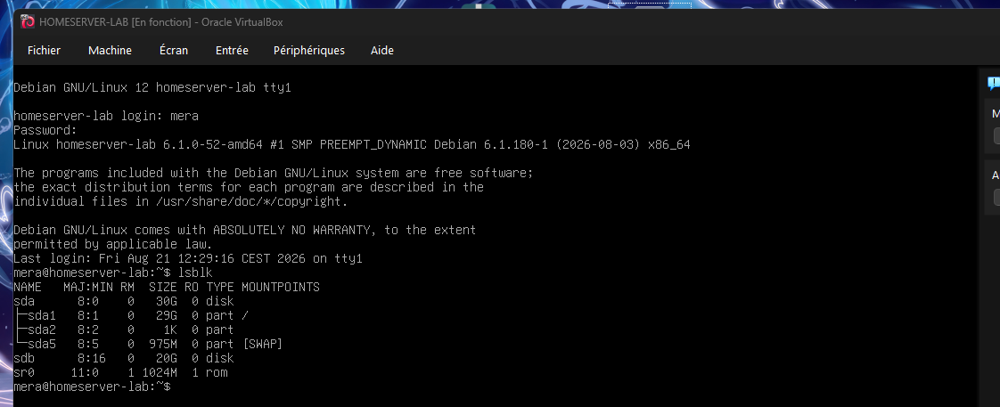

---

## 5. Disk Partitioning

The new disk initially contained no partition.

It was partitioned using `fdisk`:

```bash
sudo fdisk /dev/sdb
```

A new Linux partition was created using the available disk space.

The resulting partition is:

```text
/dev/sdb1
```

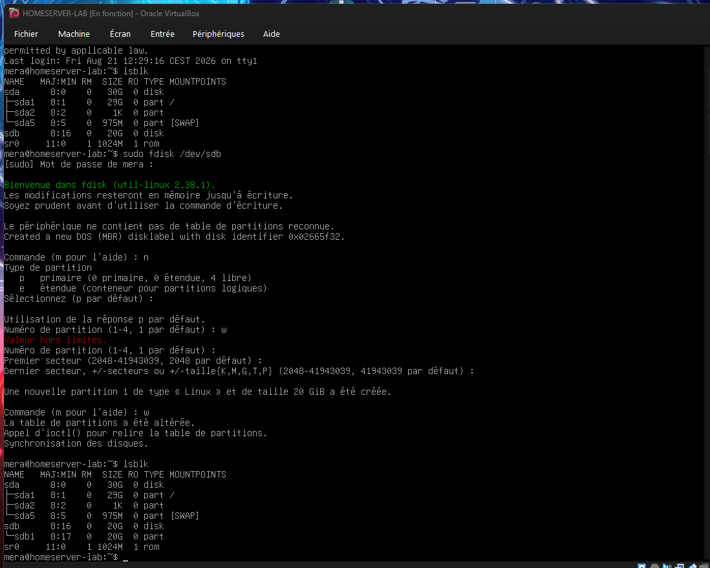

This step also provided practical experience with the interactive `fdisk` interface and verification of the resulting partition using `lsblk`.

---

## 6. ext4 Filesystem

The newly created partition was formatted using the **ext4** filesystem:

```bash
sudo mkfs.ext4 /dev/sdb1
```

The resulting filesystem was verified with:

```bash
lsblk -f
```

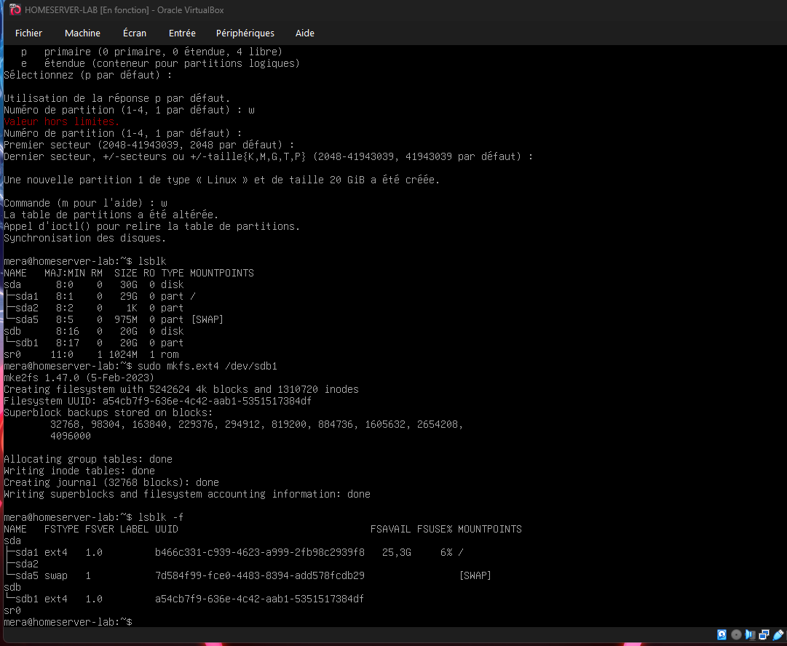

At this stage, `/dev/sdb1` has a valid filesystem but is not yet integrated into the Linux directory tree.

---

## 7. Data Mount Point

A dedicated mount point was created:

```bash
sudo mkdir -p /srv/data
```

The filesystem was then mounted:

```bash
sudo mount /dev/sdb1 /srv/data
```

The result was verified using:

```bash
lsblk
df -h /srv/data
```

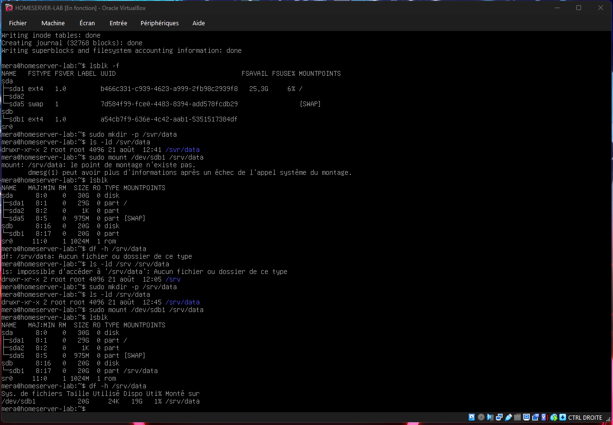

An initial mount attempt failed because the expected mount point was missing.

After recreating `/srv/data`, the filesystem mounted correctly.

This provided a simple example of troubleshooting a Linux mount operation.

---

## 8. Persistent Mount Configuration

A manual mount does not automatically survive a reboot.

The data filesystem was therefore configured in `/etc/fstab`.

First, its UUID was retrieved:

```bash
sudo blkid /dev/sdb1
```

The `/etc/fstab` entry follows this structure:

```text
UUID=<FILESYSTEM-UUID> /srv/data ext4 defaults 0 2
```

Using the filesystem UUID instead of `/dev/sdb1` avoids relying on a device name that could potentially change.

After modifying `/etc/fstab`, systemd was reloaded:

```bash
sudo systemctl daemon-reload
```

The configuration was tested **before rebooting**:

```bash
sudo mount -a
lsblk
df -h /srv/data
```

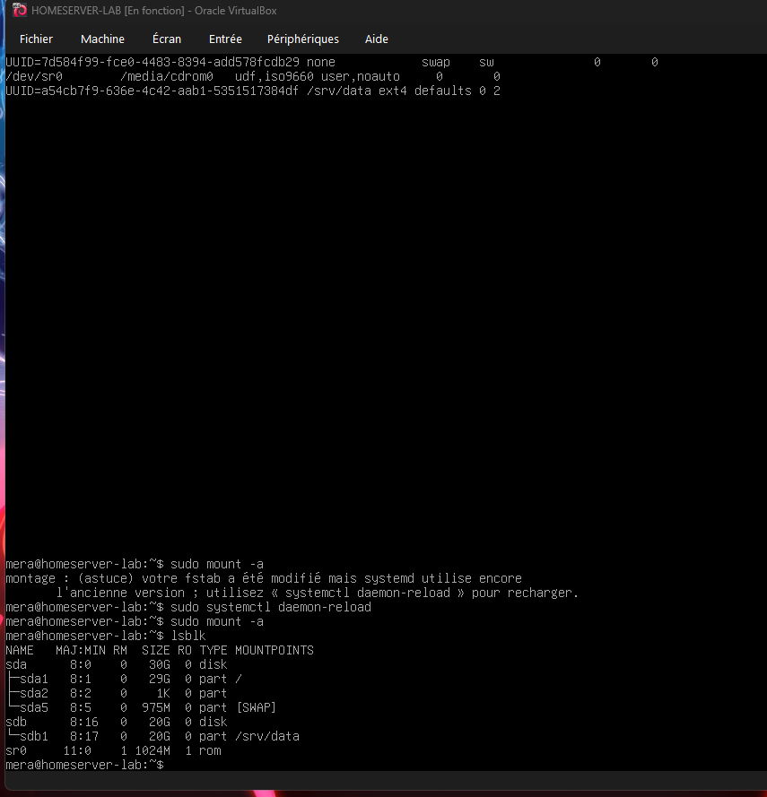

A reboot was then performed to confirm that `/srv/data` was mounted automatically.

The dedicated data disk is therefore persistent across system restarts.

---

## 9. Storage Permissions

After mounting the filesystem, `/srv/data` was owned by `root`.

A regular user therefore could not initially create files inside it.

Instead of granting overly permissive rights, a dedicated Linux group was created:

```bash
sudo groupadd homelab
```

The administrative user was added to this group:

```bash
sudo usermod -aG homelab mera
```

The directory ownership was then configured:

```bash
sudo chown root:homelab /srv/data
```

Permissions were applied using:

```bash
sudo chmod 2775 /srv/data
```

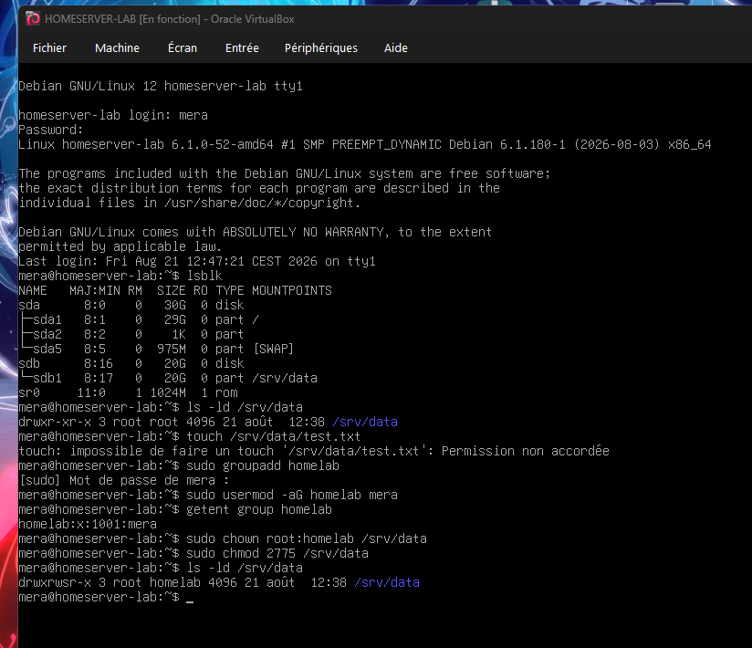

The leading `2` enables the **setgid bit**.

This means that new files and directories created inside `/srv/data` inherit the `homelab` group.

This provides a cleaner permission model than granting unrestricted access to every local user.

---

## 10. Write Access Validation

After reconnecting the user session so that the new group membership became active, write access was tested without `sudo`:

```bash
touch /srv/data/test.txt
```

The resulting file was inspected:

```bash
ls -l /srv/data
```

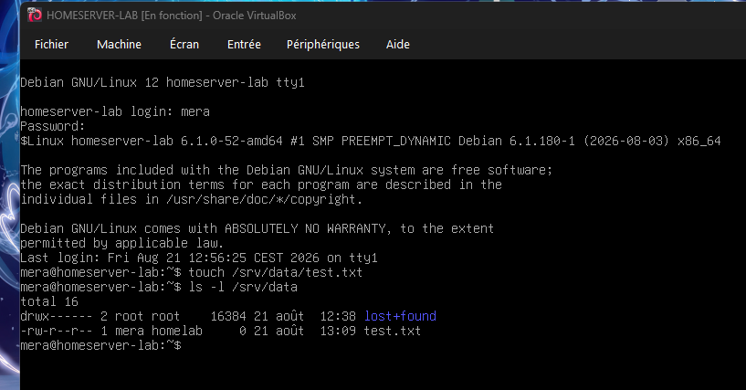

The test file was successfully created by the regular user and inherited the `homelab` group.

This confirms that the storage permissions work as intended.

---

## 11. SSH Remote Administration

OpenSSH was installed during the Debian installation and verified after the server foundation was complete.

The SSH service was checked using:

```bash
systemctl status ssh
```

The listening SSH socket was also verified:

```bash
ss -tulpn | grep :22
```

The VM network configuration was changed from VirtualBox NAT to **Bridged Networking**, allowing the server to communicate directly with the local network.

Remote connectivity from the Windows host was successfully tested.

SSH host identity was verified by comparing the server's Ed25519 fingerprint before accepting the first connection.

SSH key authentication was then configured using an **Ed25519 key pair**.

The public key is stored on the server in:

```text
~/.ssh/authorized_keys
```

with restrictive permissions:

```text
~/.ssh              700
authorized_keys     600
```

The associated private key remains exclusively on the client machine and is **never stored in this repository**.

Screenshots from this section are intentionally excluded because they contain unnecessary local network and SSH connection information.

---

## 🔐 Security Principles

This lab is not yet intended to represent a fully hardened production server.

However, several security principles are already applied:

- daily administration from a non-root account;
- privilege escalation through `sudo`;
- SSH key authentication;
- restrictive permissions on SSH configuration files;
- separation between system and data storage;
- group-based storage permissions;
- no passwords stored in the repository;
- no SSH private keys stored in the repository;
- unnecessary network information excluded from public screenshots.

SSH hardening will be continued in the next phase.

---

## 💾 Current Storage Architecture

```text
homeserver-lab
│
├── /dev/sda
│   └── Debian 12
│       └── /
│
└── /dev/sdb
    └── /dev/sdb1
        └── ext4
            └── /srv/data
```

The operating system and application data are therefore separated across two virtual disks.

`/srv/data` will serve as the main persistent storage location for future self-hosted services.

---

## 🌐 Current Architecture

```text
┌─────────────────────────────┐
│        Windows Host         │
│                             │
│      Oracle VirtualBox      │
│                             │
│        SSH Client           │
└──────────────┬──────────────┘
               │
               │ Local Network
               │
┌──────────────▼──────────────┐
│       homeserver-lab        │
│          Debian 12          │
│                             │
│  ┌───────────────────────┐  │
│  │     OpenSSH Server    │  │
│  └───────────────────────┘  │
│                             │
│  System : /dev/sda          │
│  Data   : /dev/sdb1         │
│             ↓               │
│          /srv/data          │
└─────────────────────────────┘
```

This architecture is deliberately simple during the first stage of the project.

The server foundation can now be used to deploy additional infrastructure and self-hosted services.

---

## 🛠️ Troubleshooting Encountered

The lab was built manually rather than from a preconfigured server image.

Several useful issues were encountered during the process.

### `sudo` unavailable

The initial Debian installation did not provide `sudo`.

```bash
su -
apt update
apt install sudo
usermod -aG sudo mera
```

After reconnecting, `sudo` worked correctly.

### Missing mount point

An attempt to mount the data filesystem failed because `/srv/data` was missing.

```bash
sudo mkdir -p /srv/data
sudo mount /dev/sdb1 /srv/data
```

The filesystem then mounted successfully.

### Permission denied on `/srv/data`

The regular user initially could not create files inside the data directory.

A dedicated group and setgid permissions were configured:

```bash
sudo groupadd homelab
sudo usermod -aG homelab mera
sudo chown root:homelab /srv/data
sudo chmod 2775 /srv/data
```

After reconnecting the user session, write access worked correctly.

### SSH password authentication failure

SSH connectivity worked, but password authentication initially failed.

Server logs confirmed:

```text
Failed password for <user>
```

The issue was traced to a keyboard-layout difference between the Debian console and Windows when entering numeric characters.

After correcting the password, SSH authentication worked normally.

SSH key authentication was subsequently configured to avoid relying on the account password for routine remote administration.

---

## 🗺️ Roadmap

### Phase 1 — Server Foundation ✅

- [x] Debian installation
- [x] Administrative privileges
- [x] Dedicated data disk
- [x] Partitioning
- [x] ext4 filesystem
- [x] Persistent mounting
- [x] Group-based permissions
- [x] Write access validation
- [x] SSH access
- [x] SSH key authentication

### Phase 2 — Server Hardening

- [ ] Disable SSH password authentication
- [ ] Disable direct root SSH login
- [ ] Review SSH configuration
- [ ] Configure a firewall
- [ ] Review exposed services
- [ ] Configure automatic security updates

### Phase 3 — Services

- [ ] Install Docker
- [ ] Organize persistent container data
- [ ] Deploy initial self-hosted services
- [ ] Configure service networking
- [ ] Evaluate remote-access solutions

### Phase 4 — Operations

- [ ] Implement backups
- [ ] Add monitoring
- [ ] Review logs and alerts
- [ ] Document recovery procedures
- [ ] Introduce configuration automation

---

## 📁 Repository Structure

```text
debian-homeserver-lab/
│
├── README.md
│
├── notes/
├── kb/
├── commands/
│
└── screenshots/
    ├── 01-virtualbox-vm-configuration.png
    ├── 02-debian-software-selection.png
    ├── 03-verification-systeme-initial.png
    ├── 04-installation-configuration-sudo.png
    ├── 05-verification-acces-root-sudo.png
    ├── 06-ajout-disque-virtuel-20go.png
    ├── 07-detection-second-disque.png
    ├── 08-partitionnement-disque-sdb.png
    ├── 09-formatage-ext4-sdb1.png
    ├── 10-montage-disque-srv-data.png
    ├── 11-montage-persistant-fstab.png
    ├── 12-configuration-permissions-srv-data.png
    └── 13-test-ecriture-srv-data.png
```

The `notes/`, `kb/` and `commands/` directories will progressively contain detailed documentation, troubleshooting records and reusable Linux commands.

---

## ⚠️ Disclaimer

This project is a **personal learning homelab**, not a production deployment guide.

Configurations are documented as they are implemented and may evolve as the environment becomes more secure and complex.

Passwords, private SSH keys, tokens and other authentication secrets must never be committed to this repository.

Network information that is unnecessary to demonstrate the technical configuration is intentionally excluded from the public documentation.

---

## 🎯 Project Goal

The objective is not simply to run self-hosted applications.

This project is intended to build practical experience with:

- Linux administration;
- storage and filesystems;
- users, groups and permissions;
- networking;
- remote administration;
- service management;
- system security;
- troubleshooting;
- automation;
- infrastructure documentation.

Each new component will be added progressively, tested and documented in this repository.
